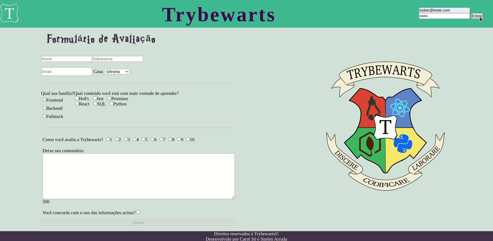
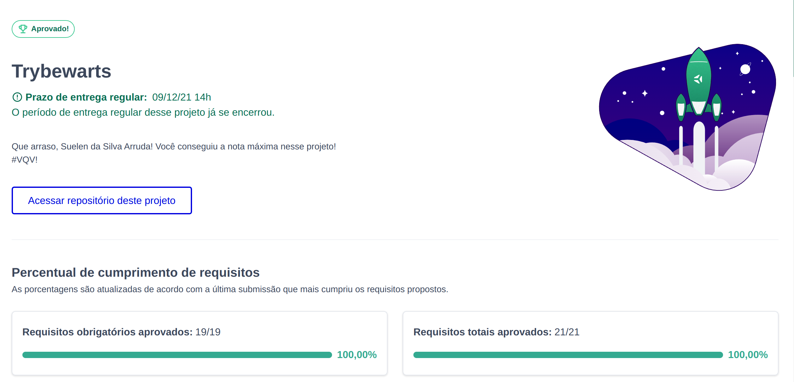

# 🧙‍♀️ Trybewarts Project 🧙‍♀️

Esse foi o primeiro projeto em grupo desde que comecei a estudar programação. Mesmo tendo estudado Psicologia, é sempre um desafio trabalhar em grupo. Desenvolver soft skills é a base, não só para o trabalho em grupo, mas, também, para nosso crescimento como pessoas profissionais (em todas as áreas).

 

## 🧹 Desenvolvedoras

Eu e esta grande mulher:  <a href="https://github.com/Carolyla">Carol</a> fizemos <em> pair progamming </em> todo o projeto! Que experiência incrível! Pude perceber que com as pessoas parceiras certas, o trabalho rende muito mais!!!

 

## 🧹 Habilidades Desenvolvidas

<li>🎃  Criar formulários em HTML; </li>
<li>🎃  Utilizar CSS Flexbox para criar layouts flexíveis; </li>
<li>🎃 Criar regras CSS específicas para serem aplicadas a dispositivos móveis; </li>
<li>🎃 Construir páginas que alteram o seu layout de acordo com a orientação da tela; </li>

 

## 🧹 O que foi desenvolvido

Neste projeto, foi desenvolvida uma página de formulário da Escola de Magia de Trybewarts, em que as pessoas estudantes poderão enviar seus feedbacks sobre ela. O tema desse projeto é baseado na obra 'Harry Potter', de J. K. Rowling.

 

## 🧹 Gif do projeto 

 

## 🧹 Status do projeto

   
